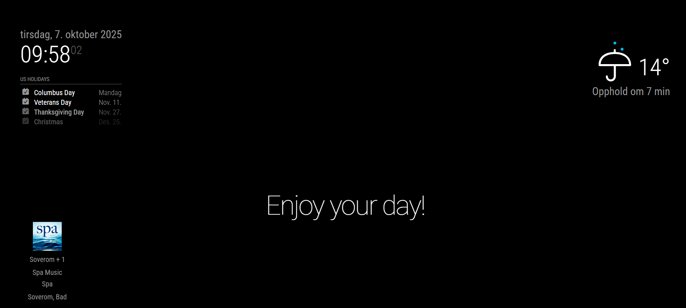

# MMM-Sonos

A MagicMirror² module that automatically discovers your Sonos zones and shows what is playing – including title, artist, album, and which speakers are in the group. The layout is tuned for both small and large displays, and you keep full control over what should be shown.

**Created by:** Mats Kjoshagen Kolstad



## Highlights

- 🔍 Automatic Sonos discovery – no manual IP configuration required.
- 🎵 Displays the current track with title, artist, album, and album art.
- 🧩 Groups are presented as a single unit (no duplicate speakers when they’re grouped).
- 🙈 Hide specific speakers or groups directly from the configuration.
- 🧱 Flexible layouts: row, grid, or automatic based on the number of groups.
- 🔠 Adjust text size, album art size, max groups, and module width via config.
- 🧭 Control alignment without extra CSS – choose left, center, right, or distributed spacing.
- 🕒 Show the last update time and optionally hide the module when nothing is playing.

## Disclaimer

This module was produced with assistance from AI tools and was originally created for my personal use. The repository is shared in the hope that it is useful to others, but I cannot guarantee ongoing maintenance or updates. Users are responsible for keeping the module updated, adapting it to their own setup, and tracking upstream changes that may affect functionality.

## Installation

1. Navigate to the MagicMirror `modules` folder and clone (or copy) the directory:

   ```pwsh
   cd ~/MagicMirror/modules
   git clone https://github.com/matskkolstad/MMM-Sonos.git
   ```

   > **Tip:** If the module already exists locally (as in this exercise), simply copy the folder into your `modules` directory.

2. Install dependencies:

   ```pwsh
   cd MMM-Sonos
   npm install
   ```

3. Add the module to `config/config.js`:

   ```javascript
   {
     module: 'MMM-Sonos',
     position: 'bottom_left',
     config: {
       updateInterval: 15000,
       displayMode: 'row',
       columns: 2,
       albumArtSize: 80,
       fontScale: 1,
       hiddenSpeakers: ['Bathroom'],
       hiddenGroups: ['Patio'],
       knownDevices: ['192.168.68.55', '192.168.68.63', '192.168.68.75'],
       showAlbum: false,
       showGroupMembers: true,
       hideWhenNothingPlaying: true,
       showWhenPaused: false,
       showPlaybackState: false,
       showLastUpdated: false,
   cardMinWidth: 150,
     }
   }
   ```

4. Start (or restart) MagicMirror². The module appears once the first Sonos group is discovered.

### Example with New Features

To use the new text alignment and size features:

```javascript
{
  module: 'MMM-Sonos',
  position: 'bottom_right',
  config: {
    textAlignment: 'right',  // Album on left, text on right (left-aligned)
    textSize: 18,            // Override text size to 18px
    albumArtSize: 100,       // Larger album art
    displayMode: 'grid',
    columns: 2
  }
}
```

## Update

When a new version is tagged, update the module with:

```pwsh
cd ~/MagicMirror/modules/MMM-Sonos
git pull
npm install
```

Restart MagicMirror² afterwards to load the latest code.

## Configuration

| Key | Default | Description |
| --- | --- | --- |
| `updateInterval` | `15000` | How often (ms) to poll Sonos for fresh data. Minimum of 5000 ms is recommended. |
| `discoveryTimeout` | `5000` | Time in ms spent discovering the first Sonos device. Increase if your network is slow. |
| `hiddenSpeakers` | `[]` | Array of room/speaker names that should never be shown. Groups containing hidden speakers are skipped. |
| `hiddenGroups` | `[]` | Hide groups by name or ID. |
| `knownDevices` | `[]` | List of static Sonos IPs to try when automatic discovery fails. |
| `maxGroups` | `6` | Maximum number of groups to render. Handy for large Sonos setups. |
| `displayMode` | `'row'` | `auto`, `grid`, or `row`. `row` keeps groups on a single horizontal line with scrolling if required. `grid` arranges cards across `columns` columns. `auto` switches to grid when the number of groups exceeds `columns`. |
| `columns` | `2` | Number of columns in grid mode (1–4). Also used as the threshold when `displayMode` is `auto`. |
| `fontScale` | `1` | Multiplier for text size. `1.2` increases text by 20%. |
| `textSize` | `null` | Override text size in pixels (e.g., `16` or `20`). When set, this overrides `fontScale`. |
| `albumArtSize` | `80` | Album-art size in pixels. |
| `wrapText` | `true` | Allow line wrapping. Set to `false` for single-line ellipsis. |
| `maxTextLines` | `2` | Maximum lines for the title (only when `wrapText` is `true`). |
| `textAlignment` | `'center'` | Text alignment: `'left'`, `'center'`, or `'right'`. When set to `'left'`, text appears on the left with album art on the right (text is right-aligned to hug the album). When set to `'right'`, album art appears on the left with text on the right (text is left-aligned to hug the album). |
| `justifyContent` | `'center'` | Horizontal distribution of cards: `'flex-start'`, `'center'`, `'space-between'`, etc. |
| `moduleWidth` | `null` | Constrain module width (e.g. `"600px"`, `"80%"`). |
| `forceHttps` | `false` | Force album art over HTTPS (useful when running behind an HTTPS reverse proxy). |
| `hideWhenNothingPlaying` | `true` | Hide the module when nothing is playing. Otherwise a calm “Nothing is playing” message is shown. |
| `showWhenPaused` | `false` | Display groups even if playback is paused. |
| `fadePausedGroups` | `true` | Dim groups that aren’t actively playing. |
| `showGroupMembers` | `true` | Show which rooms are part of the group (only when there is more than one). |
| `showPlaybackState` | `false` | Display a label for the playback state (Playing, Paused, etc.). |
| `showLastUpdated` | `false` | Show a timestamp for when the data was last refreshed. |
| `timeFormat24` | `true` | Use 24-hour time in the timestamp. |
| `dateLocale` | `'en-US'` | Locale for timestamp formatting. |
| `accentuateActive` | `true` | Highlight actively playing groups with a stronger background. |
| `showAlbum` | `false` | Display album title under the artist when available. |
| `cardMinWidth` | `150` | Minimum width for each card, used to adapt row/grid layouts. |
| `debug` | `false` | Log extra information to the MagicMirror console.

## Additional features

- **Automatic re-discovery:** If the Sonos device drops off the network, the module will try to find it again.
- **HTTPS-friendly album art:** Set `forceHttps: true` when your mirror runs behind an HTTPS proxy and browsers block mixed content.
- **Responsive layout:** The row and grid layouts adapt to smaller displays and switch orientation whenever needed.
- **Snappy updates:** Polling combined with caching keeps the UI fresh without noticeable lag.

## Development

The module includes several npm scripts for development and maintenance:

```bash
npm run lint    # Run ESLint to check code quality
npm run audit   # Check for security vulnerabilities in dependencies
npm start       # Run the node helper directly (for testing)
```

### Security Notes

This module uses dependency overrides to mitigate known security vulnerabilities in transitive dependencies:
- **axios**: Overridden to `^1.13.1` (fixes CSRF, SSRF, and DoS vulnerabilities)
- **xml2js**: Overridden to `^0.6.2` (fixes prototype pollution vulnerability)
- **ip**: Overridden to `^2.0.1` (latest available version)

**Note:** The `ip` package has a known SSRF vulnerability (GHSA-2p57-rm9w-gvfp) that affects all versions ≤2.0.1. This is a transitive dependency from the `sonos` package. No patch is currently available. The vulnerability relates to improper categorization in the `isPublic` function. Users should assess their own network configuration and threat model to determine if this poses a risk in their environment.

## Troubleshooting

- Set `debug: true` to inspect what happens in both the browser module and the node helper (visible in the MagicMirror console).
- Increase `discoveryTimeout` if no players are found. On mesh networks 10000–15000 ms is sometimes required.
- Run `npm install` again whenever dependencies appear to be missing.
- Missing album art? Try `forceHttps: true` if MagicMirror runs over HTTPS and the browser blocks plain HTTP images.
- To check for dependency vulnerabilities, run `npm run audit`.

## Roadmap ideas

Some ideas for future improvements:

- Add volume control through touch or remote notifications.
- Show the playback source (Spotify, Radio, Line-in) with an icon.
- Include a simple progress indicator for the current track.
- Cache album art locally for faster loading on slower networks.

## License

Published under the [MIT License](LICENSE). Contributions and pull requests are always welcome!
