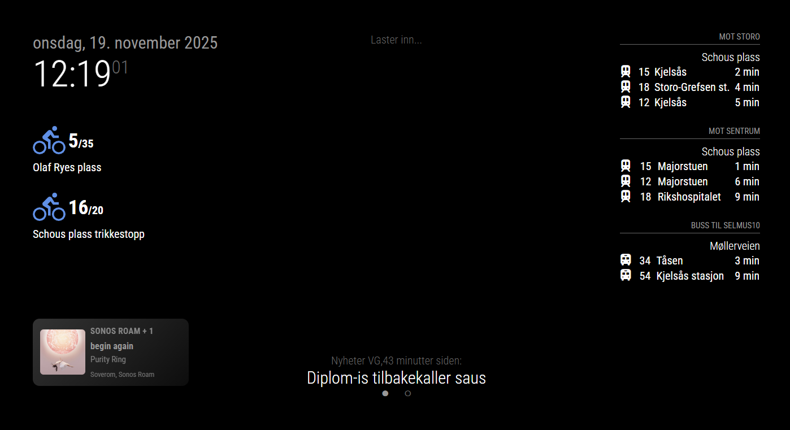

# MMM-Sonos

A MagicMirror² module that automatically discovers your Sonos zones and shows what is playing – including title, artist, album, and which speakers are in the group. The layout is tuned for both small and large displays, and you keep full control over what should be shown.

**Created by:** Mats Kjoshagen Kolstad



## Highlights

- 🔍 Automatic Sonos discovery – no manual IP configuration required.
- 🎵 Displays the current track with title, artist, album, and album art.
- 🎶 **NEW**: Shows playback source icons (Spotify, Radio, Line-in) for easy identification.
- 📊 **NEW**: Progress indicator with visual bar and time counter for track playback.
- 🔊 **NEW**: Volume display with dynamic icons showing current volume level.
- 🧩 Groups are presented as a single unit (no duplicate speakers when they’re grouped).
- 🙈 Hide specific speakers or groups directly from the configuration.
- 🧱 Flexible layouts: row, grid, or automatic based on the number of groups.
- 🔠 Adjust text size, album art size, max groups, and module width via config.
- 🧭 Control alignment without extra CSS – choose left, center, right, or distributed spacing.
- 🕒 Show the last update time and optionally hide the module when nothing is playing.

## Disclaimer

This module was produced with assistance from AI tools and was originally created for my personal use. The repository is shared in the hope that it is useful to others, but I cannot guarantee ongoing maintenance or updates. Users are responsible for keeping the module updated, adapting it to their own setup, and tracking upstream changes that may affect functionality.

## Installation

1. Navigate to the MagicMirror `modules` folder and clone (or copy) the directory:

   ```pwsh
   cd ~/MagicMirror/modules
   git clone https://github.com/matskkolstad/MMM-Sonos.git
   ```

   > **Tip:** If the module already exists locally (as in this exercise), simply copy the folder into your `modules` directory.

2. Install dependencies:

   ```pwsh
   cd MMM-Sonos
   npm install
   ```

3. Add the module to `config/config.js`. See [Configuration Examples](#configuration-examples) below for different setup options.

4. Start (or restart) MagicMirror². The module appears once the first Sonos group is discovered.

## Configuration Examples

### Minimal Configuration

The simplest setup requires no configuration at all – just add the module and it will work with default settings:

```javascript
{
  module: 'MMM-Sonos',
  position: 'bottom_left'
}
```

### Common Configuration

A typical setup with the most commonly used options:

```javascript
{
  module: 'MMM-Sonos',
  position: 'bottom_left',
  config: {
    updateInterval: 15000,           // Update every 15 seconds
    displayMode: 'row',              // Display groups in a horizontal row
    albumArtSize: 80,                // Album art size in pixels
    hideWhenNothingPlaying: true,    // Hide module when nothing is playing
    showGroupMembers: true,          // Show which rooms are in each group
    hiddenSpeakers: ['Bathroom'],    // Hide specific speakers
    knownDevices: ['192.168.1.50']   // Optional: specify device IPs if auto-discovery fails
  }
}
```

### Complete Configuration

An example showing all available configuration options:

```javascript
{
  module: 'MMM-Sonos',
  position: 'bottom_left',
  config: {
    // Discovery and updates
    updateInterval: 15000,           // Polling interval in milliseconds (minimum: 5000)
    discoveryTimeout: 5000,          // Time to wait for device discovery (0 to skip auto-discovery)
    knownDevices: [],                // Array of static Sonos IPs for fallback
    
    // Display mode and layout
    displayMode: 'row',              // 'row', 'grid', or 'auto'
    columns: 2,                      // Number of columns in grid mode (1-4)
    maxGroups: 6,                    // Maximum groups to display
    moduleWidth: null,               // Constrain width (e.g., "600px" or "80%")
    
    // Text styling
    fontScale: 1,                    // Text size multiplier (e.g., 1.2 = 20% larger)
    textSize: null,                  // Override text size in pixels (overrides fontScale)
    textAlignment: 'center',         // 'left', 'center', or 'right'
    wrapText: true,                  // Allow text wrapping
    maxTextLines: 2,                 // Max lines for title when wrapping is enabled
    
    // Album art
    albumArtSize: 80,                // Album art size in pixels
    forceHttps: false,               // Force HTTPS for album art URLs
    
    // Card layout
    cardMinWidth: 150,               // Minimum card width in pixels
    justifyContent: 'center',        // Horizontal distribution: 'flex-start', 'center', 'space-between', etc.
    
    // Visibility and filtering
    hideWhenNothingPlaying: true,    // Hide module when nothing is playing
    showWhenPaused: false,           // Show groups even when paused
    fadePausedGroups: true,          // Dim groups that aren't playing
    hiddenSpeakers: [],              // Array of speaker/room names to hide
    hiddenGroups: [],                // Array of group names or IDs to hide
    
    // Information display
    showGroupMembers: true,          // Show which rooms are in each group
    showPlaybackState: false,        // Show playback state label (Playing, Paused, etc.)
    showLastUpdated: false,          // Show timestamp of last update
    timeFormat24: true,              // Use 24-hour time format
    dateLocale: 'en-US',             // Locale for timestamp formatting
    showAlbum: false,                // Show album name under artist
    accentuateActive: true,          // Highlight actively playing groups
    
    // New features
    showPlaybackSource: true,        // Show playback source icon (Spotify, Radio, Line-in, etc.)
    showProgress: true,              // Show progress bar and time for current track
    showVolume: true,                // Show volume level for each speaker/group
    
    // TV source configuration
    showTvSource: true,              // Show TV badge when TV input is active
    showTvIcon: true,                // Display TV icon in album art slot
    tvIconMode: 'emoji',             // 'emoji', 'text', or 'svg'
    tvIcon: '📺',                    // Emoji to use when tvIconMode is 'emoji'
    tvIconText: 'TV',                // Text to use when tvIconMode is 'text'
    tvIconSvgPath: null,             // Path/URL to SVG when tvIconMode is 'svg' (defaults to bundled asset)
    tvLabel: null,                   // Override TV badge text (defaults to translated "TV")
    
    // Debugging
    debug: false                     // Enable detailed logging
  }
}
```

## Update

When a new version is tagged, update the module with:

```pwsh
cd ~/MagicMirror/modules/MMM-Sonos
git pull
npm install
```

Restart MagicMirror² afterwards to load the latest code.

## Configuration

| Key | Default | Description |
| --- | --- | --- |
| `updateInterval` | `15000` | How often (ms) to poll Sonos for fresh data. Minimum of 5000 ms is recommended. |
| `discoveryTimeout` | `5000` | Time in ms spent discovering the first Sonos device. Increase if your network is slow. |
| `hiddenSpeakers` | `[]` | Array of room/speaker names that should never be shown. Groups containing hidden speakers are skipped. |
| `hiddenGroups` | `[]` | Hide groups by name or ID. |
| `knownDevices` | `[]` | List of static Sonos IPs to try when automatic discovery fails. |
| `maxGroups` | `6` | Maximum number of groups to render. Handy for large Sonos setups. |
| `displayMode` | `'row'` | `auto`, `grid`, or `row`. `row` keeps groups on a single horizontal line with scrolling if required. `grid` arranges cards across `columns` columns. `auto` switches to grid when the number of groups exceeds `columns`. |
| `columns` | `2` | Number of columns in grid mode (1–4). Also used as the threshold when `displayMode` is `auto`. |
| `fontScale` | `1` | Multiplier for text size. `1.2` increases text by 20%. |
| `textSize` | `null` | Override text size in pixels (e.g., `16` or `20`). When set, this overrides `fontScale`. |
| `albumArtSize` | `80` | Album-art size in pixels. |
| `wrapText` | `true` | Allow line wrapping. Set to `false` for single-line ellipsis. |
| `maxTextLines` | `2` | Maximum lines for the title (only when `wrapText` is `true`). |
| `textAlignment` | `'center'` | Text alignment: `'left'`, `'center'`, or `'right'`. When set to `'left'`, text appears on the left with album art on the right (text is right-aligned to hug the album). When set to `'right'`, album art appears on the left with text on the right (text is left-aligned to hug the album). |
| `justifyContent` | `'center'` | Horizontal distribution of cards: `'flex-start'`, `'center'`, `'space-between'`, etc. |
| `moduleWidth` | `null` | Constrain module width (e.g. `"600px"`, `"80%"`). |
| `forceHttps` | `false` | Force album art over HTTPS (useful when running behind an HTTPS reverse proxy). |
| `hideWhenNothingPlaying` | `true` | Hide the module when nothing is playing. Otherwise a calm “Nothing is playing” message is shown. |
| `showWhenPaused` | `false` | Display groups even if playback is paused. |
| `fadePausedGroups` | `true` | Dim groups that aren’t actively playing. |
| `showGroupMembers` | `true` | Show which rooms are part of the group (only when there is more than one). |
| `showPlaybackState` | `false` | Display a label for the playback state (Playing, Paused, etc.). |
| `showLastUpdated` | `false` | Show a timestamp for when the data was last refreshed. |
| `timeFormat24` | `true` | Use 24-hour time in the timestamp. |
| `dateLocale` | `'en-US'` | Locale for timestamp formatting. |
| `accentuateActive` | `true` | Highlight actively playing groups with a stronger background. |
| `showAlbum` | `false` | Display album title under the artist when available. |
| `cardMinWidth` | `150` | Minimum width for each card, used to adapt row/grid layouts. |
| `showPlaybackSource` | `true` | Display the playback source icon and label (Spotify, Radio, Line-in, etc.). Icons automatically adjust based on the source. |
| `showProgress` | `true` | Show a progress bar and time counter for the current track. Only displayed when track position and duration information is available. |
| `showVolume` | `true` | Display the current volume level with an icon that changes based on volume (muted, low, medium, high). |
| `showTvSource` | `true` | Show a TV badge when a home-theater input (TV) is active. |
| `showTvIcon` | `true` | Display a TV icon in the album-art slot when TV is active. Set to `false` to keep the placeholder without the icon. |
| `tvIconMode` | `'emoji'` | Choose the TV icon type: `'emoji'` (default), `'text'`, or `'svg'`. |
| `tvIcon` | `'📺'` | Emoji used when `tvIconMode` is `'emoji'`. |
| `tvIconText` | `'TV'` | Text shown when `tvIconMode` is `'text'`. Scales with `albumArtSize`. |
| `tvIconSvgPath` | `null` | Path or URL to an SVG used when `tvIconMode` is `'svg'`. If `null`, a bundled `assets/tv-default.svg` is used. |
| `tvLabel` | `null` | Override the text label for the TV badge (defaults to the translated "TV"). |
| `debug` | `false` | Log extra information to the MagicMirror console.

### TV icon choices

- **Emoji (default):** `tvIconMode: 'emoji'` with `tvIcon` set to your preferred emoji.
- **Text:** `tvIconMode: 'text'` with `tvIconText: 'TV'` (or another string). The text scales to `albumArtSize`.
- **SVG:** `tvIconMode: 'svg'` with `tvIconSvgPath` pointing to the SVG file. You can place your file inside this module at `modules/MMM-Sonos/assets/your-tv.svg` and set `tvIconSvgPath: 'assets/your-tv.svg'`. Remote URLs are also supported. If no path is provided, the bundled `assets/tv-default.svg` is used.
- **Hide icon:** set `showTvIcon: false` to keep the album-art placeholder without an icon.

## Additional features

- **Automatic re-discovery:** If the Sonos device drops off the network, the module will try to find it again.
- **HTTPS-friendly album art:** Set `forceHttps: true` when your mirror runs behind an HTTPS proxy and browsers block mixed content.
- **Responsive layout:** The row and grid layouts adapt to smaller displays and switch orientation whenever needed.
- **Snappy updates:** Polling combined with caching keeps the UI fresh without noticeable lag.

## Module Structure

The module consists of the following files:

### Core Files
- **`MMM-Sonos.js`** - Main module file handling the UI and frontend logic
- **`node_helper.js`** - Backend helper that communicates with Sonos devices
- **`package.json`** - Node.js dependencies and metadata

### Styling
- **`css/MMM-Sonos.css`** - All module styles including layout modes, animations, and themes

### Translations
The module includes multilingual support with translations for all languages supported by MagicMirror:
- **`translations/af.json`** - Afrikaans
- **`translations/ar.json`** - Arabic
- **`translations/bg.json`** - Bulgarian
- **`translations/bn.json`** - Bengali
- **`translations/ca.json`** - Catalan
- **`translations/cs.json`** - Czech
- **`translations/cy.json`** - Welsh
- **`translations/da.json`** - Danish
- **`translations/de.json`** - German
- **`translations/el.json`** - Greek
- **`translations/en.json`** - English
- **`translations/es.json`** - Spanish
- **`translations/et.json`** - Estonian
- **`translations/fi.json`** - Finnish
- **`translations/fr.json`** - French
- **`translations/fy.json`** - Frisian
- **`translations/ga.json`** - Irish
- **`translations/gl.json`** - Galician
- **`translations/he.json`** - Hebrew
- **`translations/hi.json`** - Hindi
- **`translations/hr.json`** - Croatian
- **`translations/hu.json`** - Hungarian
- **`translations/id.json`** - Indonesian
- **`translations/is.json`** - Icelandic
- **`translations/it.json`** - Italian
- **`translations/ja.json`** - Japanese
- **`translations/ko.json`** - Korean
- **`translations/lt.json`** - Lithuanian
- **`translations/lv.json`** - Latvian
- **`translations/ms.json`** - Malay
- **`translations/nb.json`** - Norwegian Bokmål
- **`translations/nl.json`** - Dutch
- **`translations/pl.json`** - Polish
- **`translations/pt.json`** - Portuguese
- **`translations/pt-BR.json`** - Portuguese (Brazilian)
- **`translations/ro.json`** - Romanian
- **`translations/ru.json`** - Russian
- **`translations/sk.json`** - Slovak
- **`translations/sl.json`** - Slovenian
- **`translations/sv.json`** - Swedish
- **`translations/th.json`** - Thai
- **`translations/tr.json`** - Turkish
- **`translations/uk.json`** - Ukrainian
- **`translations/vi.json`** - Vietnamese
- **`translations/zh-CN.json`** - Chinese (Simplified)
- **`translations/zh-TW.json`** - Chinese (Traditional)

Supported translation keys include error messages, playback states, and UI labels. Add your own language by creating a new JSON file in the `translations` folder and adding it to the `getTranslations()` method in `MMM-Sonos.js`.

### Assets
- **`assets/tv-default.svg`** - Default TV icon for home theater sources
- **`assets/tv.svg`** - Alternative TV icon

You can add custom TV icons by placing SVG files in the `assets` folder and referencing them with the `tvIconSvgPath` configuration option.

## Development

The module includes several npm scripts for development and maintenance:

```bash
npm run lint    # Run ESLint to check code quality
npm run audit   # Check for security vulnerabilities in dependencies
npm start       # Run the node helper directly (for testing)
```

### Security Notes

This module uses dependency overrides to mitigate known security vulnerabilities in transitive dependencies:
- **axios**: Overridden to `^1.13.1` (fixes CSRF, SSRF, and DoS vulnerabilities)
- **xml2js**: Overridden to `^0.6.2` (fixes prototype pollution vulnerability)
- **ip**: Overridden to `^2.0.1` (latest available version)

**Note:** The `ip` package has a known SSRF vulnerability (GHSA-2p57-rm9w-gvfp) that affects all versions ≤2.0.1. This is a transitive dependency from the `sonos` package. No patch is currently available. The vulnerability relates to improper categorization in the `isPublic` function. Users should assess their own network configuration and threat model to determine if this poses a risk in their environment.

## Troubleshooting

- Set `debug: true` to inspect what happens in both the browser module and the node helper (visible in the MagicMirror console).
- Increase `discoveryTimeout` if no players are found. On mesh networks 10000–15000 ms is sometimes required.
- Run `npm install` again whenever dependencies appear to be missing.
- Missing album art? Try `forceHttps: true` if MagicMirror runs over HTTPS and the browser blocks plain HTTP images.
- To check for dependency vulnerabilities, run `npm run audit`.

## Roadmap ideas

Some ideas for future improvements:

- Add volume control through touch or remote notifications.
- ~~Show the playback source (Spotify, Radio, Line-in) with an icon.~~ ✅ **Completed**
- ~~Include a simple progress indicator for the current track.~~ ✅ **Completed**
- Cache album art locally for faster loading on slower networks.

## License

Published under the [MIT License](LICENSE). Contributions and pull requests are always welcome!
